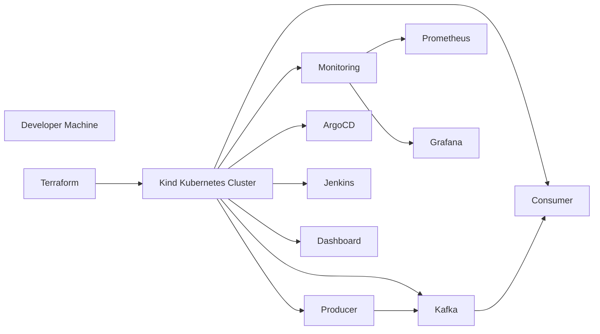
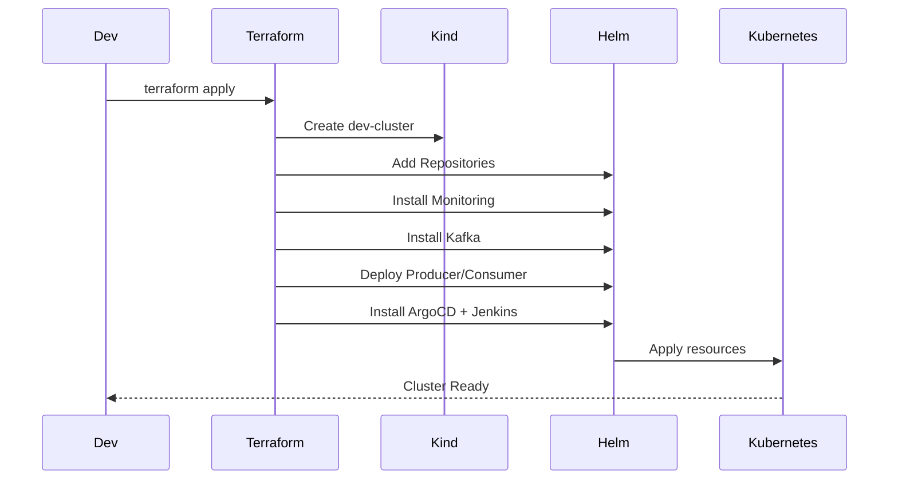

# GitOps Kubernetes Infrastructure Platform (Local Dev Environment)

End-to-end **GitOps-driven Kubernetes platform** built using **Terraform, Kind, Helm, Kafka, Observability Stack, and CI/CD tooling**.

This project demonstrates how to bootstrap a **production-like Kubernetes ecosystem locally**, using **Infrastructure as Code + GitOps principles** to achieve repeatable, automated, and scalable deployments.

---

## Why This Project Matters

This repository showcases:

- Platform Engineering mindset
- Real-world DevOps workflow
- GitOps infrastructure automation
- Event-driven microservices (Kafka)
- Observability integration
- CI/CD toolchain inside Kubernetes

**This is NOT just a cluster setup — it is a fully automated platform bootstrap.**

---

## High-Level Architecture

### System Overview



---

## Infrastructure Provisioning Flow



---

## Detailed Platform Architecture

```
                 +----------------------+
                 | Developer Machine    |
                 | Terraform + Helm     |
                 +----------+-----------+
                            |
                            v
                 +----------------------+
                 | Kind Kubernetes      |
                 | dev-cluster          |
                 +----------+-----------+
                            |
   ---------------------------------------------------
   |        |         |        |         |           |
Monitoring Kafka   Producer  Consumer  ArgoCD     Jenkins
(Prom/Graf)                                  (CI/CD)

Monitoring Stack:
- Prometheus
- Grafana

Event Driven Flow:
Producer --> Kafka --> Consumer
```

---

## What Gets Deployed Automatically

### Infrastructure

- Local Kubernetes Cluster (Kind)
- Namespaces
- Helm Repositories

### Platform Services

- Kafka Messaging System
- Producer Application
- Consumer Application

### Observability

- Prometheus
- Grafana

### DevOps / GitOps Tooling

- ArgoCD (Optional)
- Jenkins (Optional)

### Cluster Management

- Kubernetes Dashboard
- Admin RBAC Configuration

---

## Repository Structure

```
apps/                  Application manifests
charts/                Helm charts (Kafka, Producer, Consumer, Monitoring)
overlays/dev/          Environment-specific configuration
terraform/
   ├── main.tf
   ├── kind-config.yaml
   └── scripts/
```

---

## Tech Stack

| Category | Tools |
|---------|------|
| IaC | Terraform |
| Container Orchestration | Kubernetes |
| Local Cluster | Kind |
| Package Management | Helm |
| Messaging | Kafka |
| GitOps | ArgoCD |
| CI/CD | Jenkins |
| Observability | Prometheus + Grafana |

---

## How to Deploy the Entire Platform

### Prerequisites

- Docker
- Terraform
- kubectl
- Helm
- Kind

### Deployment

```bash
cd terraform
terraform init
terraform apply
```

This will:

- Create the cluster
- Install all platform components
- Output Kubernetes Dashboard token

---

## Accessing Kubernetes Dashboard

```bash
kubectl -n kubernetes-dashboard port-forward svc/kubernetes-dashboard 8443:443
```

Open:

```
https://localhost:8443
```

Generate token (if needed):

```bash
kubectl -n kubernetes-dashboard create token dashboard-admin
```

---

## GitOps Workflow

1. Infrastructure defined in Git
2. Changes committed to repository
3. ArgoCD can sync cluster automatically
4. Cluster state reconciled continuously

---

## Event-Driven Flow Demonstration

```
Producer App → Kafka Topic → Consumer App
```

Used for demonstrating:

- Async communication
- Microservices decoupling
- Streaming architecture

---

## Production Engineering Practices Demonstrated

- Declarative Infrastructure
- Idempotent Deployments
- Environment Overlays
- Dependency Ordering via Terraform
- RBAC Automation
- Helm Dependency Management
- Observability Integration

---


## Future Enhancements (Roadmap)

- Multi-cluster GitOps
- Secret Management (Vault / SOPS)
- Policy Enforcement (OPA / Kyverno)
- Automated CI Validation
- Horizontal Scaling Tests
- Service Mesh Integration

---

## Resume-Grade Impact Statement

**Designed and implemented a fully automated Kubernetes platform using Terraform, Helm, and GitOps principles, provisioning event-driven microservices (Kafka), observability stack, and CI/CD tooling within a reproducible local cluster environment.**

---

## Author

**T C Gopal**  
Software Engineer | DevOps | Kubernetes | Distributed Systems

---

## License

MIT
